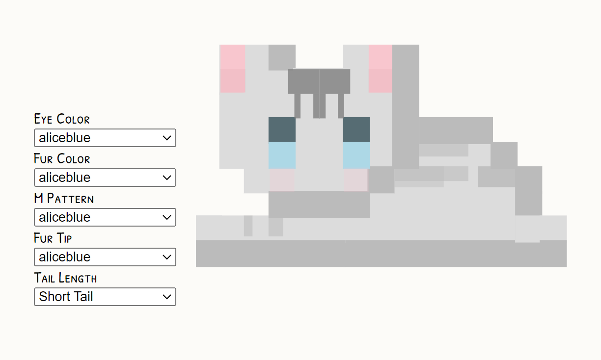

# Micromeow

Meet <strong>Micromeow</strong>, a customizable SVG cat component inspired by my cat, Pip! 🐾



## Online Demo
🌐 Try the <a href="https://natashaannn.com/micromeow!" target="_blank">interactive online demo</a> to play with more options.</p>
    
<i>🚧 The animation feature from the online demo is still pending in this package.</i>

## Installation

To install Micromeow in your project, run:

```sh
npm install micromeow
```

or using Yarn:

```sh
yarn add micromeow
```

## Usage

Import and use Micromeow in your React application:

```tsx
import { Micromeow } from "micromeow";

export default function App() {
  return (
    <MicroMeow
      eyeColor="lightblue"
      color="gainsboro"
      mPattern="gray"
      furTip="gray"
      shortTail
      pose="sphinx"
    />
  );
}
```

### Props

| Prop        | Type    | Description                                      |
|------------|--------|--------------------------------------------------|
| `eyeColor` | string | Sets the eye color of the cat.                   |
| `color`    | string | Defines the base fur color.                      |
| `mPattern` | string | Sets the color of the "M" pattern on the head.   |
| `furTip`   | string | Defines the color of the fur tips.               |
| `shortTail`| boolean | Determines if the tail is short or long.         |
| `pose`     | string | Specifies the pose (`"sphinx"`, `"lowCrouch"`).   |

## Running the Example

To test Micromeow locally, run:

```sh
npm run dev
```

This will start a development server where you can view and interact with the component.

✨ Customize various attributes of the cat in <code>src/example.tsx</code> to see changes in real-time!

## Contributing

If you'd like to contribute, fork the repository and create a pull request with your changes.

## License

MicroMeow is licensed under the MIT License.

